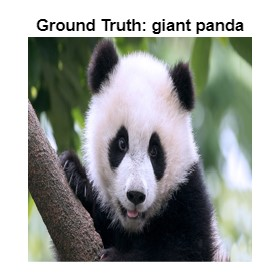
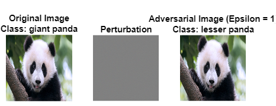
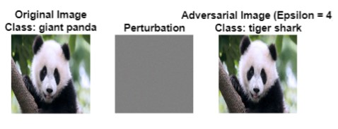

# Adversarial Image Generation with Deep Learning

This repository contains code to generate adversarial images using the GoogLeNet architecture. Adversarial images are specifically designed to deceive deep learning models by introducing imperceptible perturbations to input images. This readme provides an overview of the code and explains how to use it to generate adversarial images.

## Introduction

Adversarial images can be used to evaluate the robustness of deep learning models or to highlight vulnerabilities in their decision-making process. This code utilizes the GoogLeNet architecture, a powerful deep learning model, to generate adversarial examples. The code provides two types of adversarial attacks: untargeted and targeted.

- **Untargeted Attack**: This attack aims to misclassify the input image by modifying it slightly, without specifying a specific target class.

- **Targeted Attack**: This attack aims to force the deep learning model to classify the input image as a specific target class.

The code uses the Deep Learning Toolbox in MATLAB to perform the adversarial attacks. It modifies the input image by adding imperceptible perturbations based on the computed gradients. The perturbations are then added to the input image to generate the adversarial examples.

## Setup

To run the code, you need to have the following:

- MATLAB (version R2018b or later)
- Deep Learning Toolbox (included in MATLAB)

To set up the environment:

1. Clone or download this repository.
2. Open MATLAB and navigate to the project directory.
3. Ensure that the GoogLeNet model is available in your MATLAB environment. If not, you can download it using the following command:

   ```matlab
   gnet = googlenet;

## Results
### Original Image


### Untargeted Attack (FGSM)


### Targeted Attack (BIM)

